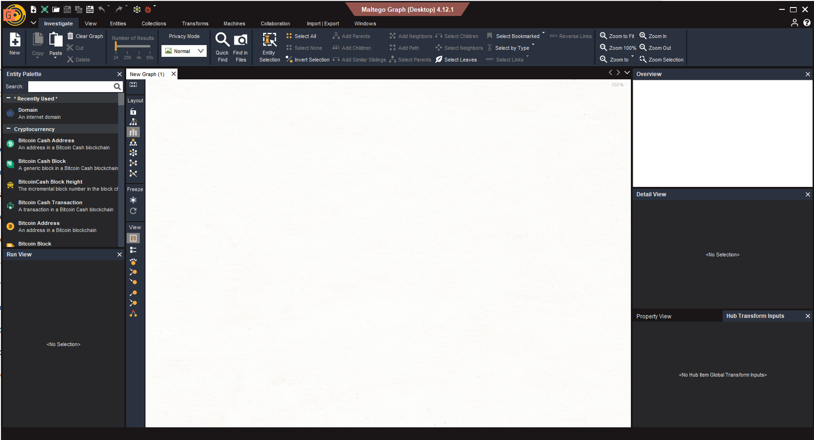
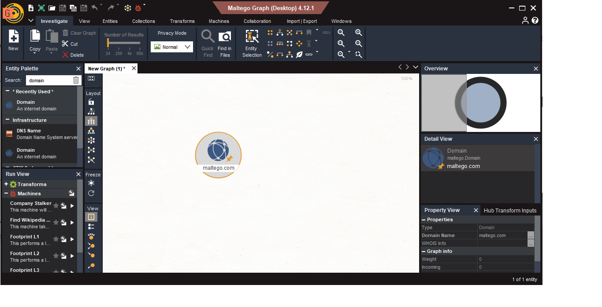
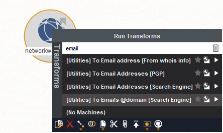
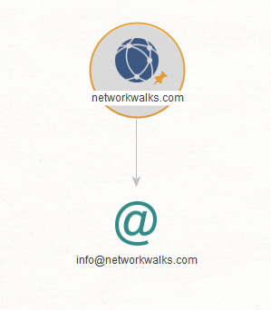
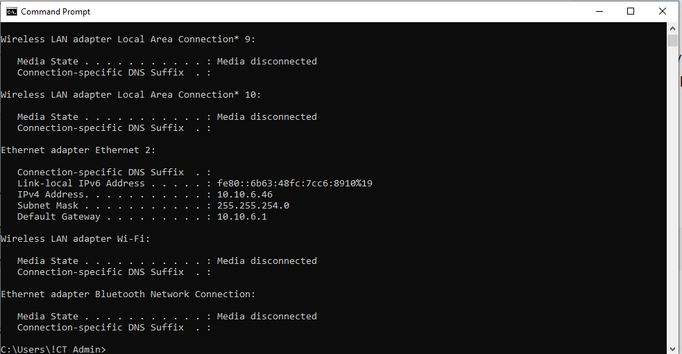
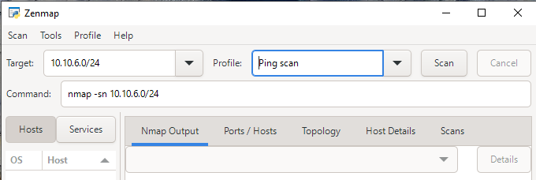
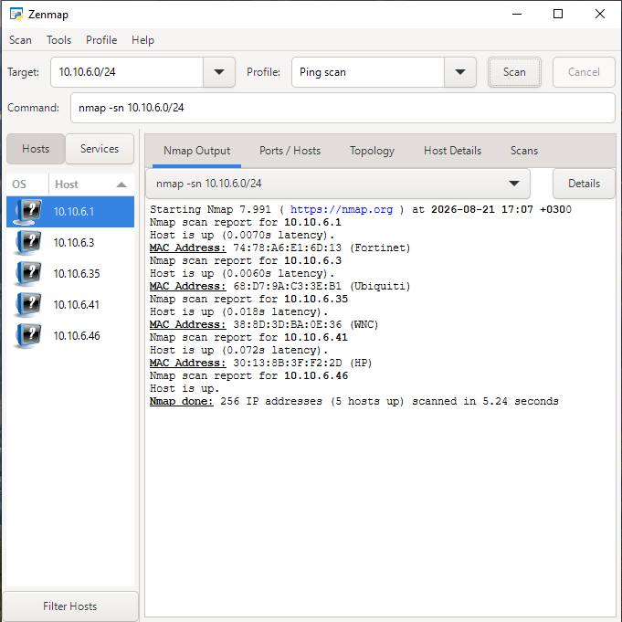
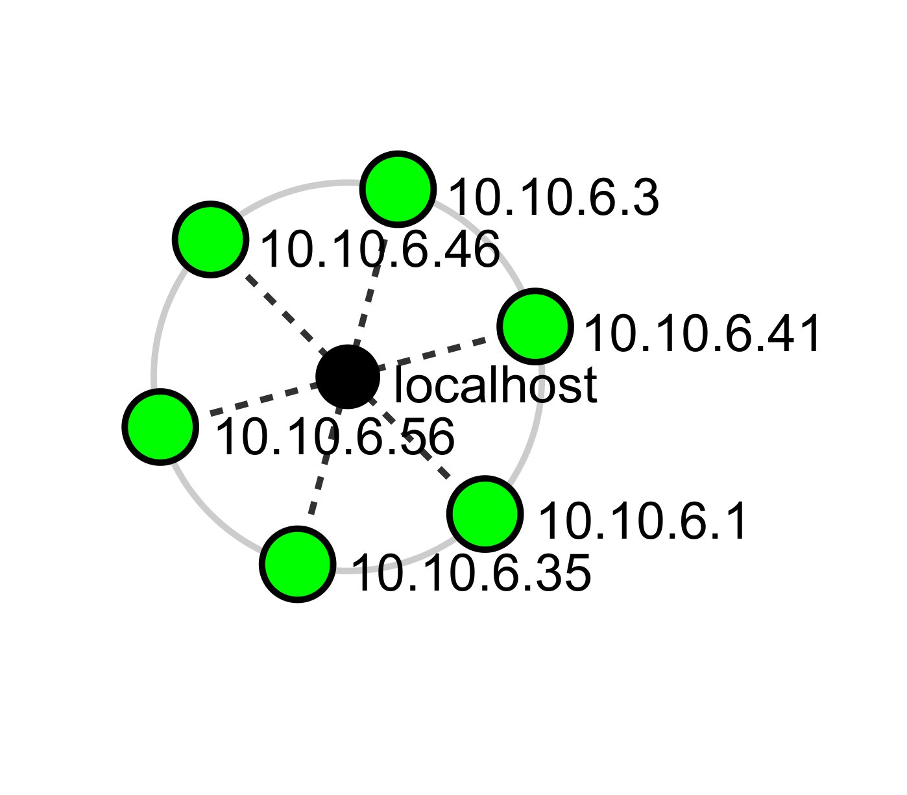

# PENETRATION TESTING REPORT

## Reconnaissance and Network Scanning

**Internship:** Cybersecurity Internship  
**Week:** 2  
**Project Modules:**  
-  Footprinting with Maltego
-  Network Scanning with Zenmap
---

# 1. Introduction

As part of Week 2 of my Cybersecurity Internship with Networkwalks, I completed practical exercises focused on two important areas of cybersecurity reconnaissance:

1. **Footprinting using Maltego**
2. **Network scanning using Zenmap**

The purpose of these exercises was to understand how cybersecurity professionals collect information about a target and identify systems that are visible within a network.

The exercises were performed for educational and authorized lab purposes. No unauthorized access, exploitation, or destructive activity was performed.

---

# 2. Objectives

The main objectives of this project were to:

- Understand the concept of reconnaissance and footprinting.
- Install and configure Maltego.
- Perform domain-based reconnaissance using Maltego.
- Identify information associated with a target domain.
- Install and configure Zenmap.
- Identify the local IP address and subnet.
- Discover live hosts within the authorized local network.
- Identify IP addresses of discovered hosts.
- Identify MAC addresses where available.
- Generate and save a network topology.
- Analyze the security implications of reconnaissance and network discovery.
---

# 3. Lab Environment

## Hardware / Operating Environment

The practical exercises were performed using a local computer and a controlled laboratory environment.

### Tools Used

| Tool | Purpose |
|---|---|
| Maltego | Footprinting and graphical reconnaissance |
| Zenmap | Graphical network scanning |
| Nmap | Scanning engine used by Zenmap |
| Windows CMD | Network configuration and IP information |
---

# 4. Footprinting with Maltego

## 4.1 Overview

Maltego is a graphical reconnaissance and investigation platform that can be used to discover relationships between domains, infrastructure, organizations, people, email addresses, and other publicly available information.

In this project, Maltego was used to perform domain-based footprinting against the authorized training target:

`networkwalks.com`

The objective was to understand how publicly available information can contribute to an organization's reconnaissance profile.

---

## 4.2 Maltego Installation

Maltego was downloaded, installed, and launched successfully on the Windows environment following these steps:
  1.  Open the website https://maltego.com → Resources tab → download Maltego → OS = Windows, Extention = .exe + Java (x64)
  2.  then Download Maltego Graph
  3.  After download complete, install the Maltego in standard way and launch.
  4.  Complete the free Maltego account creation.

### Evidence

**Observation:**  
The Maltego application was successfully installed, launched, and prepared for running reconnaissance transforms

---

## 4.3 Creating the Domain Entity

A Domain entity was created inside the Maltego workspace by Searching for “Domain” & draging to the main area.

### Evidence

**Observation:**  
The Domain entity was added to the Maltego workspace and prepared for target configuration.

---

## 4.4 Configuring the Target Domain

The Domain entity was configured with the authorized target: `networkwalks.com`

### Evidence

**Observation:**  
The target domain was successfully configured in Maltego before executing the reconnaissance transforms.

---

## 4.5 Running Email-Related Transforms

Email-related transforms were selected and executed against the configured domain.

### Evidence

**Observation:**  
The selected transforms were executed successfully and Maltego generated relationship data associated with the target domain.

---

## 4.6 Maltego Results

The final graph and reconnaissance results were captured after the transforms completed.

### Evidence

### Results Summary

The Maltego investigation produced the following results:

- **Target domain:** `networkwalks.com`
- **Email-related results:** `info@networkwalks.com`
- **Other discovered entities:** `Mail Server:` mail.networkwalks.com

> Note: The results obtained from reconnaissance tools may change over time because public information sources and their underlying data can change.

---

## 4.7 Analysis of Maltego Results

The exercise demonstrated how a domain can be used as a starting point for discovering relationships and publicly available information.

From a defensive cybersecurity perspective, information such as publicly exposed email addresses and infrastructure relationships can contribute to an organization's attack surface.

For example, exposed organizational email addresses may increase the risk of:

- Phishing attempts
- Social engineering
- Password-spraying attempts
- Targeted reconnaissance

The important lesson is that information does not need to be obtained through unauthorized access to become useful to an attacker. Publicly exposed information can already provide valuable intelligence.

---

# 5. Network Scanning with Zenmap

## 5.1 Overview

Zenmap is the official graphical user interface for Nmap.

It provides a visual interface for network discovery and scanning while using the Nmap scanning engine underneath.

In this exercise, Zenmap was used to identify live hosts within my authorized local network.

---

# 5.2 Identifying the Local IP Address and Subnet

The Windows `ipconfig` command was used to identify the local network configuration as shown bellow:

---

# 5.3 Configuring the Zenmap Ping Scan

After identifying the local subnet, Zenmap was configured to perform a Ping Scan against the authorized local network.

Scan Configuration
Parameter	Value
Scan Type	Ping Scan
Target	[YOUR LOCAL SUBNET]
Purpose	Live Host Discovery
Evidence

---

# 5.4 Live Host Discovery

The Ping Scan was executed to identify active hosts within the authorized local network.

Evidence

Discovered Hosts
No.	IP Address	Status
1	[IP ADDRESS]	Up
2	[IP ADDRESS]	Up
3	[IP ADDRESS]	Up
4	[IP ADDRESS]	Up
5	[IP ADDRESS]	Up
Total Live Hosts

[NUMBER OF LIVE HOSTS]

# 5.5 IP Address Information

The scan results were reviewed to identify the IP addresses of the discovered live hosts.

No.	IP Address	Status
1	[IP ADDRESS]	Up
2	[IP ADDRESS]	Up
3	[IP ADDRESS]	Up
4	[IP ADDRESS]	Up
5	[IP ADDRESS]	Up

# 5.6 MAC Address Information

MAC address information was reviewed for the discovered hosts where available.

Evidence

MAC Address Results
No.	IP Address	MAC Address
1	[IP ADDRESS]	[MAC ADDRESS]
2	[IP ADDRESS]	[MAC ADDRESS]
3	[IP ADDRESS]	[MAC ADDRESS]
4	[IP ADDRESS]	[MAC ADDRESS]
5	[IP ADDRESS]	[MAC ADDRESS]

# 5.7 Network Topology

After completing the network discovery scan, the network topology was generated and saved as a PDF.

Topology

Topology File
zenmap/
└── 06-zenmap-topology.pdf

# 5.8 Zenmap Scan Results

The Zenmap scan successfully identified active hosts within the authorized local network.

Summary
Item	Result
Scanned Network	[YOUR LOCAL SUBNET]
Scan Type	Ping Scan
Live Hosts	[NUMBER]
IP Addresses Identified	[NUMBER]
MAC Addresses Identified	[NUMBER]
Topology Generated	Yes

# 5.9 Analysis

The network scan demonstrated how Zenmap can be used to discover active systems within an authorized network.

The scan identified live hosts and provided IP address information, while MAC address information was available for hosts where it could be determined.

The topology generated from the scan provided a visual representation of the discovered network environment.

# 5.10 Security Relevance

Network discovery is an important part of cybersecurity because it helps organizations understand which systems are active and visible within their networks.

The information obtained during the scan can support:

Network asset inventory
Identification of unknown devices
Detection of unauthorized systems
Network segmentation reviews
Security monitoring
Network administration

# 5.11 Conclusion

The Zenmap practical exercise was successfully completed. I installed Zenmap, identified the local IP address and subnet, configured and performed a Ping Scan, discovered live hosts, reviewed IP and MAC address information, and generated a network topology.

This exercise provided practical experience in network discovery and demonstrated how Zenmap can be used as a cybersecurity reconnaissance and network administration tool within an authorized environment.
